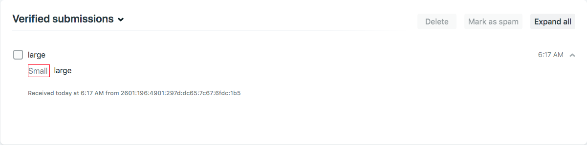
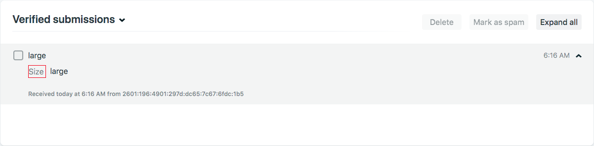

# Netlify-Gatsby Radio Buttons Example

The repository demonstrates how to use radio buttons on Netlify forms built in Gatsby.

[](https://app.netlify.com/start/deploy?repository=https://github.com/stevepolitodesign/netlify-gatsby-radio-buttons-example)

## Problem

If you don't wrap the `input` in a `label`, the results will save incorrectly as seen below. "Small" should really be "size", since "size" is the name of the `input`

```
<input type="radio" name="size" id="small" value="small" required />
<label htmlFor="small">Small</label>
```



## Solution

Wrap the `input` in a `label` to ensure the name of the `input` is used in the results.

```
<label>
    <input type="radio" name="size" id="small" value="small" required /> Small
</label>
```


